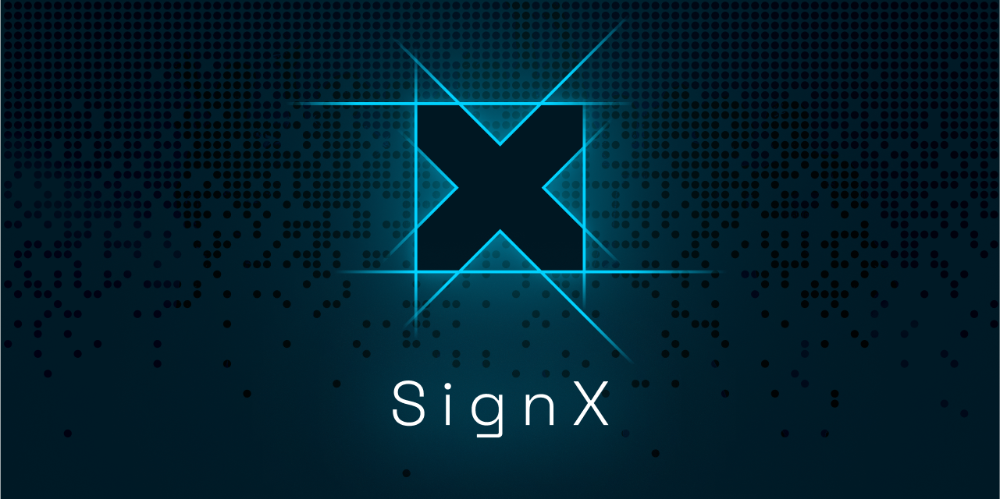

# SignX SDK

[](https://ixo.foundation)
[](https://github.com/ixofoundation/ixo-signx)

[](https://github.com/ixofoundation/ixo-signx/blob/main/LICENSE)

[](https://twitter.com/ixoworld)
[](https://ixoworld.medium.com/)


<p align="center">
  
</p>

<br />

The SignX SDK provides an easy way to integrate mobile-to-web authentication and transaction signing using the IXO blockchain in your applications.

This repo and product is intentionally managed as Open Source and we aim to use this guide to light our way https://opensource.guide/.
Let us know how we are doing!

## 📝 Description

The SignX SDK orchestrates a seamless and secure interaction between client applications, a mobile app, and a server, encapsulating the complexities of mobile-to-web authentication and transaction signing on the IXO blockchain. The flow is initiated when a client application triggers a login request through the SDK, which in turn generates a unique identifier and a secure hash. This information is encoded into a QR code that is displayed to the user. Upon scanning this QR code with the mobile app, the user's account details are securely transmitted to the server.

During this phase, the SDK engages in a polling mechanism, continually checking the server for the authentication response corresponding to the QR code data. This ensures that the client application is updated in near real-time once the user has completed the scanning process. The SDK has built-in error handling and timeout features to manage scenarios where the response from the server is delayed or unsuccessful. Upon receiving a successful response from the server, the SDK triggers an event notifying the client application of the successful login, and provides the user's account details for further interactions.

With the user now authenticated, the SDK facilitates transaction operations. When a transaction is initiated through the SDK, it packages the necessary transaction data and securely transmits this, along with a unique transaction hash, to the server. Similar to the login flow, a QR code is generated for the user to scan using the mobile app. This QR code encodes information required for the mobile app to retrieve the transaction data from the server, sign the transaction, and broadcast it to the IXO blockchain.

Post the QR code generation, the SDK re-engages its polling mechanism, constantly checking the server for updates regarding the transaction status. The mobile app, after broadcasting the transaction, uploads the transaction response to the server. Once the server processes this response, it updates the transaction status which is then picked up by the SDK in one of its polling iterations. Upon receiving a successful or failed transaction response, the SDK emits an event to inform the client application of the outcome, thus completing the transaction flow.

Through this orchestrated flow, the SignX SDK abstracts the technical intricacies, providing a straightforward and secure way for client applications to leverage mobile-to-web authentication and transaction signing on the IXO blockchain.

The SDK is crafted to interact harmoniously with a designated server, which handles the storage and provides the necessary endpoints for polling data during the authentication and transaction processes. To fully leverage the SDK's capabilities and ensure a streamlined operation, it is essential to set up and utilize the accompanying server, the source code for which can be found [here](https://github.com/ixofoundation/ixo-message-relayer).

## 🔨 Install

```sh
npm install @ixo/signx-sdk

yarn add  @ixo/signx-sdk
```

## 💻 Usage

This SDK exposes a client class SignX which can be instantiated in your client applications to interact with the SignX server and mobile app for various operations.

Import and initialize the SignX client in your application:

```js
import { SignX } from '@ixo/signx-sdk';

const signXClient = new SignX({
	endpoint: 'https://your-signx-server.com',
	sitename: 'YourSiteName',
	network: 'mainnet',
});
```

### Login

Initiate a login request using the `login` method:

```js
const loginRequest = await signXClient.login();

// Use loginRequest data to show QR code to user for scanning by mobile app
```

Subscribe to events for success or failure [here](#event-handling)

### Transacting

Initiate a transaction using the `transact` method:

```js
const transactRequest = await signXClient.transact(TRANSACT_DTO);

// Use transactRequest data to show QR code to user for scanning by mobile app
```

Subscribe to events for success or failure [here](#event-handling). TRANSACT_DTO type can be seen [here](#types)

### Event Handling

Listen for success and error events emitted by the SignX client:

```js
signXClient.on(SIGN_X_LOGIN_SUCCESS, data => {
	console.log('Login Success:', data);
});

signXClient.on(SIGN_X_LOGIN_ERROR, error => {
	console.error('Login Error:', error);
});

signXClient.on(SIGN_X_TRANSACT_SUCCESS, data => {
	console.log('Transaction Success:', data);
});

signXClient.on(SIGN_X_TRANSACT_ERROR, error => {
	console.error('Transaction Error:', error);
});
```

## 📎 Utility Functions

### hashTransactData

Hashes transaction data for use in the transact method:

```js
// hashTransactData(data: TRANSACT_DTO): string
const hash = hashTransactData(transactData);
```

### generateSecureHash

Generates a secure hash from a given hash and nonce:

```js
// generateSecureHash(hash: string, nonce: string): string
const secureHash = generateSecureHash(hash, nonce);
```

### convertDataToDeeplink

Generates a deeplink uri that contains all the data fields as uri parameters, ready for the ImpactsX App to use.
You can change the schema if you want to use another app, ImpactsX App scheme is `impactsx` and that is the default.
The ImpactsX App can handle the SignX deeplinks, menaing if it is opened on mobile it will open the app if installed, parse the parameters, and run the neccesary function, same as if the data was scanned from within the ImpactsX App. Most mobile devices can also reading and opening deeplink uri's from the devices native camera, that means you can also use the deplink in the qr code for the users to scan as they can then scan the qr code either from within the ImpactsX app or using the devices native camera and it will open the app.

```js
// convertDataToDeeplink(data: Types.LOGIN_DATA | Types.TRANSACT_DATA, scheme = 'impactsx'): string
const deeplinkUri = convertDataToDeeplink(data); // data is the object returned from transact or login methods
```

## 🖇️ API Reference

### Types

- NETWORK: The network type:
  ```js
  type NETWORK = 'mainnet' | 'testnet' | 'devnet';
  ```
- TRANSACT_DTO: The data transfer object for transactions:
  ```js
  type TRANSACT_DTO = {
  	address: string, // bech32 encoded address, as received from login (eg ixo123)
  	did: string, // base64 encoded did, as received from login (eg did:x:1234)
  	pubkey: string, // hex encoded pubkey, as receivced from login
  	txBodyHex: string, // hex encoded raw txBodyBytes which can be encoded from the registry exported from @ixo/impactxclient-sdk npm package (eg registry.encodeTxBody({ messages, memo }))
  	timestamp: string, // stringified utc DateTime, add uniqueness for tx hash to prevent duplicates (eg new Date().toISOString())
  };
  ```

### Class SignX

#### Properties

- timeout: The timeout for polling in milliseconds (default is 2 minutes).
- pollingInterval: The interval between polling requests in milliseconds (default is 2.5 seconds).
- network: The network type.
- endpoint: The endpoint URL of the SignX server.
- sitename: The name of your site. (shown on mobile app on request)

#### Methods

- login: Initiates a login request and starts polling.
- transact: Initiates a transaction and starts polling.
- stopPolling: Stops the polling process.

## 📱 Examples

Example used in a React project:

```js
let signXClient: SignX;

let signXInitializing = false;
export const initializeSignX = async (
  chainInfo: KEPLR_CHAIN_INFO_TYPE,
  walletUser?: USER,
): Promise<USER | undefined> => {
  if (signXInitializing) return;
  signXInitializing = true;

  let handleClose: () => void;
  try {
    if (!chainInfo || !chainInfo.chainId) throw new Error('No chain info found to initialize SignX');
    if (chainInfo.chainName !== 'ixo') throw new Error('SignX only works on ixo chain');

    signXClient = new SignX({
      endpoint: 'https://signx.devnet.ixo.earth',
      network: chainInfo.chainNetwork || 'mainnet',
      sitename: config.siteName ?? 'JAMBO dApp',
    });

    // if user already has an address or pubkey(already signed in), return
    if (walletUser?.address || walletUser?.pubKey) return walletUser;

    // get login data from client to display QR code and start polling
    const data = await signXClient.login({ pollingInterval: 2000 });

    const closeModal = () => {
      signXClient.off(SIGN_X_LOGIN_ERROR, () => {});
      signXClient.off(SIGN_X_LOGIN_SUCCESS, () => {});
      signXClient.stopPolling('Login cancelled', SIGN_X_LOGIN_ERROR);
    };

    handleClose = renderModal(
      <SignXModal
        title='SignX Login'
        subtitle='Scan QR with your ImpactsX wallet'
        data={JSON.stringify(data)}
        timeout={signXClient.timeout}
      />,
      closeModal,
    );

    const eventData: any = await new Promise((resolve, reject) => {
      const handleSuccess = (data: any) => {
        signXClient.off(SIGN_X_LOGIN_ERROR, handleError); // Remove error listener once successful
        resolve(data);
      };
      const handleError = (error: any) => {
        signXClient.off(SIGN_X_LOGIN_SUCCESS, handleSuccess); // Remove success listener on error
        reject(error);
      };

      signXClient.on(SIGN_X_LOGIN_SUCCESS, handleSuccess);
      signXClient.on(SIGN_X_LOGIN_ERROR, handleError);
    });
    handleClose(); // manually close the modal after event emitted

    return {
      name: eventData.data.name,
      address: eventData.data.address,
      pubKey: fromHex(eventData.data.pubKey),
      did: eventData.data.did,
      algo: eventData.data.algo,
    };
  } catch (e) {
    console.error('ERROR::initializeSignX::', e);
    // handle error like sign out of wallet
    const event = new Event(EVENT_LISTENER_TYPE.wallet_logout);
    window.dispatchEvent(event);
  } finally {
    signXInitializing = false;
    if (handleClose) handleClose();
  }
};

let signXBroadCastMessageBusy = false;
export const signXBroadCastMessage = async (
  msgs: TRX_MSG[],
  memo = '',
  chainInfo: KEPLR_CHAIN_INFO_TYPE,
  wallet: WALLET,
): Promise<string | null> => {
  if (signXBroadCastMessageBusy) return null;
  signXBroadCastMessageBusy = true;

  let handleClose: () => void;
  try {
    if (!chainInfo || !chainInfo.chainId) throw new Error('No chain info found');
    if (chainInfo.chainName !== 'ixo') throw new Error('SignX only works on ixo chain');

    if (!wallet.user) throw new Error('No user found to broadcast transaction');
    if (!signXClient) throw new Error('No signXClient found to broadcast transaction');

    const registry = createRegistry();

    // get login data from client to display QR code and start polling
    const data = await signXClient.transact({
      address: wallet.user.address,
      did: wallet.user.did!,
      pubkey: toHex(wallet.user.pubKey),
      timestamp: new Date().toISOString(),
      txBodyHex: toHex(registry.encodeTxBody({ messages: msgs as any, memo })),
    });

    const closeModal = () => {
      signXClient.off(SIGN_X_TRANSACT_ERROR, () => {});
      signXClient.off(SIGN_X_TRANSACT_SUCCESS, () => {});
      signXClient.stopPolling('Transaction cancelled', SIGN_X_TRANSACT_ERROR);
    };

    handleClose = renderModal(
      <SignXModal
        title='SignX Transaction'
        subtitle='Scan QR with your ImpactsX wallet'
        data={JSON.stringify(data)}
        timeout={signXClient.timeout}
      />,
      closeModal,
    );

    const eventData: any = await new Promise((resolve, reject) => {
      const handleSuccess = (data: any) => {
        signXClient.off(SIGN_X_TRANSACT_ERROR, handleError); // Remove error listener once successful
        resolve(data);
      };
      const handleError = (error: any) => {
        signXClient.off(SIGN_X_TRANSACT_SUCCESS, handleSuccess); // Remove success listener on error
        reject(error);
      };

      signXClient.on(SIGN_X_TRANSACT_SUCCESS, handleSuccess);
      signXClient.on(SIGN_X_TRANSACT_ERROR, handleError);
    });
    handleClose(); // manually close the modal after event emitted

    console.log({ eventData });

    return eventData.data?.transactionHash;
  } catch (e) {
    console.error('ERROR::signXBroadCastMessage::', e);
    Toast.errorToast(`Transaction Failed`);
    return null;
  } finally {
    signXBroadCastMessageBusy = false;
    if (handleClose) handleClose();
  }
};

```

## 📃 License

This SDK is licensed under the Apache 2 License. See the [LICENSE](/LICENSE) file for more information.
