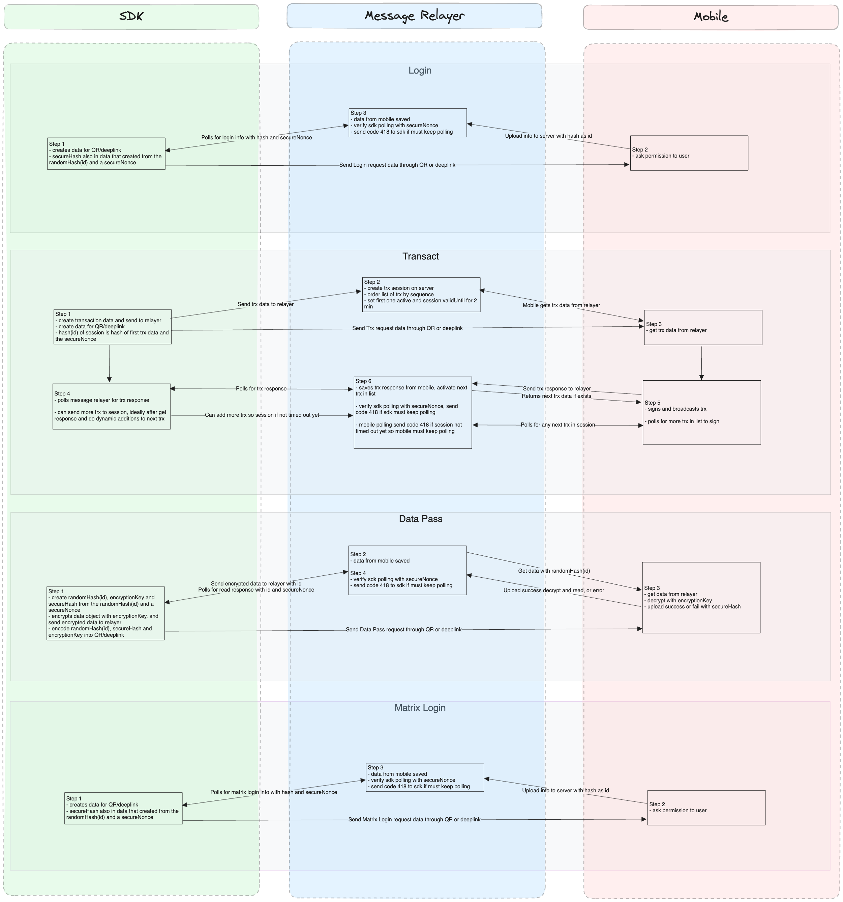

# SignX SDK

[](https://ixo.foundation)
[](https://github.com/ixofoundation/ixo-signx)

[](https://github.com/ixofoundation/ixo-signx/blob/main/LICENSE)

[](https://twitter.com/ixoworld)
[](https://ixoworld.medium.com/)


<p align="center">
  
</p>

<br />

The SignX SDK provides an easy way to integrate mobile-to-web authentication and transaction signing using the IXO blockchain in your applications.

This repo and product is intentionally managed as Open Source and we aim to use this guide to light our way https://opensource.guide/.
Let us know how we are doing!

- [SignX SDK](#signx-sdk)
  - [📝 Description](#-description)
  - [🔨 Install](#-install)
  - [💻 Usage](#-usage)
    - [Initialization](#initialization)
    - [Login](#login)
    - [Data Handling](#data-handling)
    - [Transacting](#transacting)
    - [Event Handling](#event-handling)
      - [Event Descriptions](#event-descriptions)
        - [Login Events](#login-events)
        - [Data Events](#data-events)
        - [Transaction Events](#transaction-events)
        - [Transaction session Events](#transaction-session-events)
  - [📎 Utility Functions](#-utility-functions)
    - [hashTransactData](#hashtransactdata)
    - [generateSecureHash](#generatesecurehash)
    - [convertDataToDeeplink](#convertdatatodeeplink)
    - [encryptJson](#encryptjson)
    - [decryptJson](#decryptjson)
  - [🖇️ API Reference](#️-api-reference)
    - [Types](#types)
    - [Class SignX](#class-signx)
      - [Properties](#properties)
      - [Methods](#methods)
  - [📱 Examples](#-examples)
  - [📃 License](#-license)

## 📝 Description

The SignX SDK orchestrates a seamless and secure interaction between client applications, a mobile app, and a server, encapsulating the complexities of mobile-to-web authentication, data handling, and transaction signing on the IXO blockchain. The flow is initiated when a client application triggers a login request through the SDK, which in turn generates a unique identifier and a secure hash. This information is encoded into a QR code that is displayed to the user. Upon scanning this QR code with the mobile app, the user's account details are securely transmitted to the server.

During this phase, the SDK engages in a polling mechanism, continually checking the server for the authentication response corresponding to the QR code data. This ensures that the client application is updated in near real-time once the user has completed the scanning process. The SDK has built-in error handling and timeout features to manage scenarios where the response from the server is delayed or unsuccessful. Upon receiving a successful response from the server, the SDK triggers an event notifying the client application of the successful login, and provides the user's account details for further interactions.

The SDK supports secure data handling between the client application and the mobile app. This feature allows the client application to securely pass encrypted data to the mobile app, which can then decrypt and process it. The following steps outline this process:

1. Data Handling Initiation:
   When initiating a data handling request, the SDK encrypts the provided data using AES-256-CBC encryption and generates a secure hash. This encrypted data, along with its unique hash and secure hash, is sent to the server.
2. QR Code Generation and Scanning:
   The SDK generates a QR code containing the hash and secure hash, along with the encryption key. Upon scanning this QR code, the mobile app fetches the encrypted data from the server.
3. Data Decryption and Processing:
   The mobile app decrypts the data using the encryption key provided in the QR code. Depending on the type of data (e.g. kyc (KYC information)), the mobile app processes the data accordingly.
4. Data Handling Response:
   After processing the data, the mobile app updates the server with the result, which includes a success status and any relevant response message. The SDK then fetches this response and notifies the client application of the outcome.

In its upgraded version, the SDK introduces enhanced transaction operations through the v2 transaction module from the message-relayer server. This module allows for managing a sequence of multiple transactions within a session, offering a more dynamic and flexible approach than the initial single-transaction model.

1. Transaction Session Initiation:
   When a transaction session begins, the SDK packages the necessary data and securely transmits it, along with a unique session hash, to the server. This hash is a combination of the initial transaction data hash and a secure nonce, ensuring robust security and validation mechanisms.
2. QR Code Generation and Scanning:
   For transaction initiation, the SDK generates a QR code for user scanning. The QR code contains the session hash, enabling the mobile app to fetch the entire session data, including all transactions within the session and their current states.
3. Long Polling Mechanism:
   Unlike the earlier model, the v2 module uses long polling for fetching updates on transaction statuses and responses from the server. This method is more data-efficient and provides timely updates, enhancing the user experience and optimizing resource utilization.
4. Session Progression and Transaction Handling:
   As the mobile app processes each transaction within the session, it updates the server with the transaction status. The server then automatically sets the next transaction in the sequence as active. The SDK’s long polling mechanism picks up these updates, informing the client application about each transaction's outcome.
5. Session Continuity and Enhanced Error Handling:
   The SDK manages the session's continuity by handling the addition of new transactions to the ongoing session and dealing with any errors or timeouts efficiently.

In a typical transaction flow using the SignX SDK, the client experiences a streamlined, sequential processing of multiple transactions within a single session. Imagine a scenario where the client initiates a transaction session with two transactions. The SDK starts by generating a unique session hash, embedding it in a QR code for the mobile app to scan. Once scanned, the mobile app accesses the session, fetching the first transaction for processing.

The SDK, utilizing long polling, awaits the mobile app's response. If the first transaction is successfully signed and broadcasted by the mobile app, the SDK receives an update on this transaction's status. The server, in response, activates the next transaction in the sequence, which is then fetched by the SDK through its ongoing long polling on the /next endpoint.

Throughout this process, the SDK emits relevant events, keeping the client informed about each transaction's status. If the mobile app signs the second transaction, the cycle continues with the SDK receiving updates and the session progressing seamlessly. Importantly, the client has the flexibility to add more transactions to the active session as long as it remains open. This dynamic addition is facilitated by the transactSessionHash property exposed by the SDK. If this property is present, indicating an ongoing session, any subsequent transact calls by the client are routed to add transactions to the existing session. The SDK smartly handles scenarios where the session might expire or not be found, in which case it initiates a new session.

Conversely, if any transaction within the session encounters an error or is denied on the mobile app, the SDK terminates the entire session. This decisive action ensures integrity and consistency within the transaction flow. Additionally, the transactSequence property is accessible to clients, offering visibility into the current transaction's sequence number within the session. This feature enhances the user's understanding of their progress within a session.

An important aspect to note is the session's persistence. The SDK is designed for use within an active session, meaning that if the client's browser or tab is refreshed, the session information is lost, as it's not stored in local state. This design decision emphasizes the importance of completing transactions within the continuity of an active session, ensuring security and data integrity.

In summary, the SignX SDK's v2 transaction flow offers clients an efficient, flexible, and secure method for handling multiple transactions. With features like long polling, dynamic session management, and real-time updates, it provides a seamless experience for both the end-users and the client applications.

Through this sophisticated flow, the SignX SDK abstracts complex technical processes, offering client applications a streamlined and secure mechanism for mobile-to-web authentication, secure data handling, and multi-transaction processing on the IXO blockchain.

The SDK is crafted to interact harmoniously with a designated server, which handles the storage and provides the necessary endpoints for polling data during the authentication, data handling, and transaction processes. To fully leverage the SDK's capabilities and ensure a streamlined operation, it is essential to set up and utilize the accompanying server, the source code for which can be found [here](https://github.com/ixofoundation/ixo-message-relayer).

Below, you'll find a diagram that shows how the SignX SDK works. It illustrates the steps involved when the client application, the Message Relayer server, and the mobile app interact with each other. This visual guide is meant to help you easily understand the process of authentication, secure data handling, and transaction signing, making it easier to see how everything comes together.

<p align="center">
  
</p>

## 🔨 Install

```sh
npm install @ixo/signx-sdk

yarn add  @ixo/signx-sdk
```

## 💻 Usage

The SignX SDK offers a client class, SignX, to facilitate secure and streamlined interactions between client applications, a mobile app, and the SignX server. This setup simplifies mobile-to-web authentication and transaction signing on the IXO blockchain as well as secure data passing.

### Initialization

Import and initialize the SignX client in your application:

```js
import { SignX } from '@ixo/signx-sdk';

const signXClient = new SignX({
	endpoint: 'https://your-signx-server.com',
	sitename: 'YourSiteName',
	network: 'mainnet',
});
```

### Login

To initiate a login request, use the `login` method. This generates necessary data, including a unique hash and secure hash, for QR code generation.

```js
const loginRequest = await signXClient.login();

// Use loginRequest data to display a QR code for scanning by the mobile app
```

Subscribe to login-related events for monitoring the success or failure of the login process. More details on event handling are available [here](#event-handling)

### Data Handling

The dataPass method is used to create a secure data request on the server. The client encrypts the data, and the mobile app decrypts and processes it.

```js
const dataRequest = await signXClient.dataPass({ data: yourData, type: 'kyc' });

// Use dataRequest to show QR code to user for scanning by the mobile app
```

The method returns data indicating the encryption key and the secure hash. The SDK will handle the polling for the processing outcome.

Subscribe to data-related events for monitoring the success or failure of the data process. More details on event handling are available [here](#event-handling)

### Transacting

The `transact` method is used for initiating a transaction session or adding transactions to an existing active session. The existence of an active session is indicated by the `transactSessionHash` property on the client.

```ts
const transactRequest = await signXClient.transact(data: Types.TRANSACT_DTO, forceNewSession = false);

// Use transactRequest data to show QR code to user for scanning by mobile app
```

The method returns data indicating whether a new session was initiated or transactions were added to an existing session. The `forceNewSession` parameter can be used to explicitly start a new session despite an ongoing session. If a new session has been started then the response will look like:

```js
{
  sessionHash: this.transactSessionHash,
  hash: transactions[0].hash,
  type: Constants.SIGN_X_TRANSACT,
  sitename: this.sitename,
  network: this.network,
  version: Constants.TRANSACT_VERSION,
}
```

containing `type: Constants.SIGN_X_TRANSACT` or you can also check if it contains a `sessionHash`.
If the response doesn't contain any of those 2 fields then it means a new session wasn't started but the transactions were added to the current active session and the response will look as follows, containing the current active transactions details:

```js
{
  message: 'Transactions added to session successfully',
  activeTransaction: {
    hash: activeTrx.hash,
    sequence: activeTrx.sequence,
    validUntil: activeTrx.validUntil,
  },
}
```

Subscribe to transaction-related events for success or failure notifications [here](#event-handling). TRANSACT_DTO type can be seen [here](#types)

### Event Handling

The SignX client emits various events to inform about different stages and statuses of login, data handling, and transaction processes. Events are useful for real-time updates and error handling in the client application. Event strings can be imported from the SDK constants. Below is an example of how to subscribe to an event type:

```js
signXClient.on(SIGN_X_LOGIN_SUCCESS, data => {
	console.log('Login Success:', data);
});
```

#### Event Descriptions

##### Login Events

`SIGN_X_LOGIN_SUCCESS`: Emitted when the login process completes successfully, returning user's account details. Returns:

```js
{
   message: 'Login request fetched successfully',
   success: true,
   data: {
     name: "wallet name on ImpactsX",
     address: "account address",
     pubKey: "hex encoded pubkey",
     algo: "wallet algo type (secp/ed)",
     did: "wallet did",
   },
}
```

`SIGN_X_LOGIN_ERROR`: Emitted in case of any error during the login process. Returns an error message.

##### Data Events

`SIGN_X_DATA_SUCCESS`: Emitted when the data request is processed successfully by the mobile app, returning the processing outcome. Returns:

```js
{
   message: 'Data response fetched successfully',
   response: "response message from mobile app" // dynamic field, can be string or object de[pending on mobile handling for the data type]
   success: true,
}
```

`SIGN_X_DATA_ERROR`:Emitted in case of any error during the data processing, returning an error message.

##### Transaction Events

`SIGN_X_TRANSACT_SUCCESS`: Emitted when the current active transaction is successfully processed, from polling `/response`. Returns:

```js
{
   message: 'Transaction request found',
   data: {
     // data returned from successfull broadcast from mobile app, returns data as returned from chain, eg:
     code: 0,
     transactionHash: "transaction hash",
   }
   success: true,
   validUntil: "DateTime of sessions new validUntil",
   // return next active transaction if available
   activeTransaction: {
     hash: "next active transactions hash",
     sequence: "next active transactions sequence",
     validUntil: "next active transactions DateTime validUntil",
   }
}
```

`SIGN_X_TRANSACT_ERROR`: Emitted in case of any error during current active transaction processing, from polling `/response`. Returns an error message.

##### Transaction session Events

`SIGN_X_TRANSACT_SESSION_STARTED`: Emitted when a new transaction session begins from the `transact` method. Returns:

```js
{
   sessionHash: "new transaction session's hash",
   activeTransaction: {
     hash: "active transactions hash",
     sequence: "active transactions sequence",
     validUntil: "active transactions DateTime validUntil",
   }
}
```

`SIGN_X_TRANSACT_SESSION_NEW_TRANSACTION`: Emitted when a new transaction within the ongoing session is activated and is being polled for on the /response endpoint. Emitted either when new activeTransaction is present in the `/response` response or when the `/next` polling gets an activeTransaction in the response. Returns:

```js
{
   ...data, // other data depending if coming from /response or /next
   activeTransaction: {
     hash: "next active transactions hash",
     sequence: "next active transactions sequence",
     validUntil: "next active transactions DateTime validUntil",
   }
}
```

`SIGN_X_TRANSACT_SESSION_ENDED`: Emitted when a transaction session is terminatedon sdk side, indicating the reason for termination. Emitted either from `/next` polling if session on server times out, or in the clients `stopPolling` and `clearTransactSession` is true. Returns an error message indicating reason for session end.

## 📎 Utility Functions

### hashTransactData

Hashes transaction data for use in the transact method:
`fixedSort` is the parameter to indicate whether json stringification should be from sorted object, default is true, keep option for false for backwards compatibility with previous v1 single transactions flow.

```js
// hashTransactData(data: TRANSACT_DTO, fixedSort = true): string
const hash = hashTransactData(transactData);
```

### generateSecureHash

Generates a secure hash from a given hash and nonce:

```js
// generateSecureHash(hash: string, nonce: string): string
const secureHash = generateSecureHash(hash, nonce);
```

### convertDataToDeeplink

Generates a deeplink uri that contains all the data fields as uri parameters, ready for the ImpactsX App to use.
You can change the schema if you want to use another app, ImpactsX App scheme is `impactsx` and that is the default.
The ImpactsX App can handle the SignX deeplinks, meaning if it is opened on mobile it will open the app if installed, parse the parameters, and run the neccesary function, same as if the data was scanned from within the ImpactsX App. Most mobile devices can also reading and opening deeplink uri's from the devices native camera, that means you can also use the deplink in the qr code for the users to scan as they can then scan the qr code either from within the ImpactsX app or using the devices native camera and it will open the app.

The data parameter is used to determine the type from `data.type` and conversely parse the rest of data and generate the deeplink according to the type property. If you want to generate a generic clean deeplink then use a object with `type: SIGN_X_CLEAN_DEEPLINK`.

```js
// convertDataToDeeplink(data: Types.LOGIN_DATA | Types.TRANSACT_DATA | Types.DATA_PASS_DATA, scheme = 'impactsx'): string
const deeplinkUri = convertDataToDeeplink(data); // data is the object returned from transact, login, or dataPass methods
```

### encryptJson

Encrypts a JSON object with the provided key (hexadecimal string) using AES-256-CBC encryption. The encrypted data is returned as a base64 encoded string. This function ensures secure data transmission and storage by converting a JSON object to a string, encrypting it with AES-256-CBC, and then encoding it in base64 for safe transfer.

```js
// encryptJson<T>(jsonData: T, key: string): string
const encryptedData = encryptJson(yourData, 'yourEncryptionKeyInHex');
```

### decryptJson

Decrypts a base64 encoded string containing encrypted JSON data using AES-256-CBC decryption. This function reverses the encryption process, taking a base64 encoded string, extracting the IV, decrypting the data with the provided key, and returning the original JSON object.

```js
// decryptJson<T>(encryptedData: string, key: string): T
const decryptedData = decryptJson(encryptedData, 'yourEncryptionKeyInHex');
```

## 🖇️ API Reference

### Types

- NETWORK: The network type:
  ```js
  type NETWORK = 'mainnet' | 'testnet' | 'devnet';
  ```
- TRANSACTION: The data type for a single transactions:
  ```js
  type TRANSACTION = {
  	txBodyHex: string, // hex encoded raw txBodyBytes which can be encoded from the registry exported from @ixo/impactxclient-sdk npm package (eg registry.encodeTxBody({ messages, memo }))
  	sequence: number, // the sequence for the server to sort the transaction for the session by, if transactions are just being added to an already existing session then the sequence order is only for the batch getting appended to the already existing transactions.
  };
  ```
- TRANSACT_DTO: The data transfer object for transactions:
  ```js
  type TRANSACT_DTO = {
  	address: string, // bech32 encoded address, as received from login (eg ixo123)
  	did: string, // base64 encoded did, as received from login (eg did:x:1234)
  	pubkey: string, // hex encoded pubkey, as receivced from login
  	timestamp: string, // stringified utc DateTime, add uniqueness for tx hash to prevent duplicates (eg new Date().toISOString())
  	transactions: TRANSACTION[], // the list of transactions to create for the session or add to the already existing session
  };
  ```

### Class SignX

#### Properties

- `timeout`: Duration (in milliseconds) before the polling operation times out. Defaults to 2 minutes.
- `pollingInterval`: The interval between polling requests in milliseconds (default is 2.5 seconds). No need for a short one as polling endpoints implemented long polling, this is just for inbetween long polling sessions.
- `network`: Network type (mainnet, testnet, devnet).
- `endpoint`: URL of the SignX server.
- `sitename`: Name of your site, displayed on the mobile app during authentication and transaction requests.
- `transactSessionHash`: If present it is the current active transaction session hash, also indicating there is a current active session and calling the `client.transact()` method will add the transactions to the session and not start a new session.
- `transactSequence`: The current active transaction's sequence number, to show clients the current active sequence number so clients can know there is a new transaction to sign on mobile or help indicate what is going on and where in the flow the user is.

#### Methods

- `login()`: Initiates a login request and starts polling for authentication response.
- `dataPass(data, type, pollingInterval?)`: Initiates a secure data request, encrypts the data, uploads it to the server, and starts polling for the data response.
- `transact(transactData, forceNewSession = false)`: Initiates or add to a transaction session and starts polling for response of active transaction.
- `pollTransactionResponse(activeTrxHash)`: Poll for the active transaction response, which is identified through the provided activeTrxHash paramater, thus knowing the activeTrxHash is neccesary.
- `pollNextTransaction()`: Poll for the next transaction in a session, will also error if session ends on server side, will grab the transactSessionHash, so a current active session is required. Useful when awaiting the progression of transaction sequences.
- `stopPolling(errorMessage, failEvent, clearTransactSession = true)`: Stops the polling process, aborts the long polling requests and if transactSessionHash is present and paramater `clearTransactSession` is not set to false, then will clear the `transactSessionHash` also.

## 📱 Examples

The SignX SDK, with its comprehensive client properties and methods, and the ability to emit crucial events, empowers developers to create bespoke user interfaces that not only guide users through the mobile handling process via QR codes or deeplinks but also keep them informed about their progress in the transaction session, or data handling. Developers can leverage the SDK to showcase the transaction session sequence to users, updating them when a new transaction signing is required on the mobile device.

It's important to note that while the transaction session feature is versatile, allowing multiple transactions to be batched together, it's not mandatory to use it in full. Developers have the flexibility to initiate just a single transaction per session, simplifying the process. Conversely, the SDK supports dependent sequential transactions, enabling developers to add subsequent transactions only after the prior one has been successfully signed and broadcasted, and necessary data for the next transaction is available. This flexibility is especially useful in cases where transactions are too large and need to be split into smaller, more manageable parts for efficient blockchain processing. The SignX SDK offers a range of possibilities and workflows to suit various requirements.

In the upcoming example, we illustrate a basic and straightforward implementation of the SignX SDK, inside a React website. This example demonstrates a simple flow that aligns with Cosmos offline wallet signer types and takes advantage of the session feature. It showcases the addition of transactions to an ongoing session, provided the session remains active within its timeout period. This approach is ideal for scenarios where transactions are dependent on one another, ensuring smooth and efficient transaction processing. But in then case the session expired it will start a new session and accordingly display the QR with needed data for mobile to grab the new session. It also showcases how to call the dataPass method and how it can also be plugged into the generic signX QR/deeplink interface that already exists for the login and transactions flow.

```ts
let signXClient: SignX;

let signXInitializing = false;
export const initializeSignX = async (chainInfo: KEPLR_CHAIN_INFO_TYPE, walletUser?: USER): Promise<USER | undefined> => {
	if (signXInitializing) return;
	signXInitializing = true;

	let removeModal: () => void;
	try {
		if (walletUser?.chainId && walletUser?.chainId !== chainInfo.chainId) throw new Error('Chains changed, please logout and login again');
		if (!chainInfo || !chainInfo.chainId) throw new Error('No chain info found to initialize SignX');
		if (chainInfo.chainName !== 'ixo') throw new Error('SignX only works on ixo chain');

		signXClient = new SignX({
			endpoint: SIGN_X_RELAYERS[chainInfo.chainNetwork || 'mainnet'],
			network: chainInfo.chainNetwork || 'mainnet',
			sitename: config.siteName ?? 'JAMBO dApp',
		});

		// if user already has an address or pubkey, return
		if (walletUser?.address || walletUser?.pubKey) return walletUser;

		// get login data from client to display QR code and start polling
		const data = await signXClient.login({ pollingInterval: 1000 });

		// callback for when modal is closed manually
		const onManualCloseModal = () => {
			signXClient.stopPolling('Login cancelled', SIGN_X_LOGIN_ERROR);
		};

		removeModal = renderModal(<SignXModal title="SignX Login" data={data} timeout={signXClient.timeout} transactSequence={1} />, onManualCloseModal);

		const eventData: any = await new Promise((resolve, reject) => {
			const handleSuccess = (data: any) => resolve(data);
			const handleError = (error: any) => reject(error);
			signXClient.on(SIGN_X_LOGIN_SUCCESS, handleSuccess);
			signXClient.on(SIGN_X_LOGIN_ERROR, handleError);
		});

		return {
			name: eventData.data.name,
			address: eventData.data.address,
			pubKey: fromHex(eventData.data.pubKey),
			did: eventData.data.did,
			algo: eventData.data.algo,
			chainId: chainInfo.chainId,
		};
	} catch (e) {
		console.error('ERROR::initializeSignX::', e);
		const event = new Event(EVENT_LISTENER_TYPE.wallet_logout);
		window.dispatchEvent(event);
	} finally {
		signXInitializing = false;
		// @ts-ignore
		if (removeModal) removeModal();
		// remove event listeners
		signXClient.removeAllListeners(SIGN_X_LOGIN_ERROR);
		signXClient.removeAllListeners(SIGN_X_LOGIN_SUCCESS);
	}
};

let signXBroadCastMessageBusy = false;
export const signXBroadCastMessage = async (msgs: TRX_MSG[], memo = '', fee: TRX_FEE_OPTION, feeDenom: string, chainInfo: KEPLR_CHAIN_INFO_TYPE, wallet: WALLET): Promise<string | null> => {
	if (signXBroadCastMessageBusy) return null;
	signXBroadCastMessageBusy = true;

	let removeModal: () => void;
	// callback for when modal is closed manually
	let onManualCloseModal = (clearSession = true) => {
		signXClient.stopPolling('Transaction cancelled', SIGN_X_TRANSACT_ERROR, clearSession);
	};

	try {
		if (!chainInfo || !chainInfo.chainId) throw new Error('No chain info found');
		if (chainInfo.chainName !== 'ixo') throw new Error('SignX only works on ixo chain');

		if (!wallet.user) throw new Error('No user found to broadcast transaction');
		if (!signXClient) throw new Error('No signXClient found to broadcast transaction');

		const registry = createRegistry();
		const txBody = toHex(registry.encodeTxBody({ messages: msgs as any, memo }));

		// get transact data from client to start polling, display QR code if new session
		const data = await signXClient.transact({
			address: wallet.user.address,
			did: wallet.user.did!,
			pubkey: toHex(wallet.user.pubKey),
			timestamp: new Date().toISOString(),
			transactions: [{ sequence: 1, txBodyHex: txBody }],
		});

		// if already active session(aka no sessionHash), start polling for next transaction that was just added
		if (!data?.sessionHash) {
			signXClient.pollNextTransaction();
		}

		removeModal = renderModal(<SignXModal title="SignX Transaction" data={data} timeout={signXClient.timeout} transactSequence={signXClient.transactSequence} />, onManualCloseModal);

		// wait for transaction to be broadcasted and SignX to emit success or fail event
		const eventData: any = await new Promise((resolve, reject) => {
			const handleSuccess = (data: any) => resolve(data);
			const handleError = (error: any) => reject(error);
			signXClient.on(SIGN_X_TRANSACT_SUCCESS, handleSuccess);
			signXClient.on(SIGN_X_TRANSACT_ERROR, handleError);
		});

		return eventData.data?.transactionHash;
	} catch (e) {
		console.error('ERROR::signXBroadCastMessage::', e);
		Toast.errorToast(`Transaction Failed`);
		return null;
	} finally {
		signXBroadCastMessageBusy = false;
		// @ts-ignore
		if (removeModal) removeModal();
		// @ts-ignore
		if (onManualCloseModal) onManualCloseModal(false);
		// remove event listeners
		signXClient.removeAllListeners(SIGN_X_TRANSACT_ERROR);
		signXClient.removeAllListeners(SIGN_X_TRANSACT_SUCCESS);
	}
};

let signXDDataPassBusy = false;
export const signXDataPass = async (jsonData: any, type: string): Promise<any> => {
	if (signXDDataPassBusy) return null;
	signXDDataPassBusy = true;

	let removeModal: () => void;
	// callback for when modal is closed manually
	let onManualCloseModal = (clearSession = true) => {
		signXClient.stopPolling('Data Pass cancelled', SIGN_X_DATA_ERROR, clearSession);
	};

	try {
		if (!signXClient) throw new Error('No signX client initiated');

		// get data pass data from client to start polling and display QR code for key passing
		const data = await signXClient.dataPass({
			data: jsonData,
			type,
		});

		removeModal = renderModal(<SignXModal title="SignX Data Pass" data={data} timeout={signXClient.timeout} transactSequence={1} />, onManualCloseModal);

		// wait for data to be passed and handled and SignX to emit success or fail event
		const eventData: any = await new Promise((resolve, reject) => {
			const handleSuccess = (data: any) => resolve(data);
			const handleError = (error: any) => reject(error);
			signXClient.on(SIGN_X_DATA_SUCCESS, handleSuccess);
			signXClient.on(SIGN_X_DATA_ERROR, handleError);
		});

		return eventData;
	} catch (e: any) {
		console.error('ERROR::signXDataPass::', e);
		Toast.errorToast(`SignX Data Pass Failed: ${e.message}`);
		return null;
	} finally {
		signXDDataPassBusy = false;
		// @ts-ignore
		if (removeModal) removeModal();
		// @ts-ignore
		if (onManualCloseModal) onManualCloseModal(false);
		// remove event listeners
		signXClient.removeAllListeners(SIGN_X_DATA_ERROR);
		signXClient.removeAllListeners(SIGN_X_DATA_SUCCESS);
	}
};
```

Below is the accompanying UI for the SignXModal used above:

```ts
type SignXProps = {
	title: string;
	subtitle?: string;
	data: any;
	timeout: number;
	transactSequence?: number;
} & HTMLAttributes<HTMLDivElement>;

const SignX: FC<SignXProps> = ({ title, subtitle, data, timeout, transactSequence }) => {
	const isNewSession = transactSequence === 1;
	const firstLoad = useRef(false);
	const timeoutFull = (timeout - 1000) / 1000;
	const timeoutThird = timeoutFull / 3;
	const deeplink = convertDataToDeeplink(isNewSession ? data : { type: SIGN_X_CLEAN_DEEPLINK });
	const downloadLink = isIOS || isMacOs ? `https://apps.apple.com/app/impacts-x/id6444948058` : `https://play.google.com/store/apps/details?id=com.ixo.mobile`;

	useEffect(() => {
		if (firstLoad.current) return;
		firstLoad.current = true;

		if (isMobile) {
			console.log('isMobile');
			setTimeout(() => {
				const newWindow = window.open(deeplink, '_top', 'noopener,noreferrer');
				if (newWindow) newWindow.opener = null;
			});
		}
	}, []);

	return (
		<div className={styles.signx}>
			<h2>{title}</h2>
			{!isNewSession ? (
				<p>
					Please open your{' '}
					<a href={downloadLink} rel="noopener noreferrer" target="_blank">
						Impacts X App
					</a>{' '}
					and sign transaction #{transactSequence}
				</p>
			) : subtitle ? (
				<p>{subtitle}</p>
			) : (
				<p>
					Scan QR with your{' '}
					<a href={downloadLink} rel="noopener noreferrer" target="_blank">
						Impacts X App
					</a>
				</p>
			)}
			<div className={styles.timeWrapper}>
				<CountdownCircleTimer
					isPlaying
					duration={timeoutFull}
					colors={[getCSSVariable('--primary-color') || ('#004777' as any), '#F7B801', '#A30000']}
					colorsTime={[timeoutFull, timeoutThird, 0]}
					size={75}
					strokeWidth={5}
				>
					{({ remainingTime, color }) => (
						<div className={styles.time} style={{ color: color }}>
							<div>{remainingTime}</div>
							<p>seconds</p>
						</div>
					)}
				</CountdownCircleTimer>
			</div>
			{isNewSession && (
				<>
					<QRCode value={JSON.stringify(data)} size={250} />
					<p className={styles.deeplink}>
						If you are on a mobile device please install the{' '}
						<a href={downloadLink} rel="noopener noreferrer" target="_blank">
							Impacts X App
						</a>{' '}
						and then click{' '}
						<a href={deeplink} rel="noopener noreferrer" target="_blank">
							here
						</a>
						.
					</p>
				</>
			)}
		</div>
	);
};
```

And lastly the accompanying renderModal function:

```ts
/**
 * Render a modal with the given content
 * @param content The content to render in the modal
 * @param onClose Function to execute when manually close the modal through clicking the close button or backdrop
 * @returns Function to close the modal, only removing the React component, not executing the onClose function
 */
export const renderModal = (content: ReactNode, onClose: () => void) => {
	const modalDiv = document.getElementById('custom-root') as HTMLElement;
	const root = createRoot(modalDiv);

	// Function to execute when manually close the modal
	const handleManualClose = () => {
		handleClose();
		onClose();
	};

	const handleClose = () => {
		root.unmount(); // Unmount the React component
	};

	// Render your Modal component into the div
	root.render(<Modal onClose={handleManualClose}>{content}</Modal>);

	return handleClose;
};
```

As highlighted in the example, it's worth emphasizing that this demonstration is a streamlined and straightforward implementation, seamlessly adaptable to existing Offline Wallet Signer frameworks commonly utilized in wallets like Keplr. Developers are equipped to craft tailored user interfaces that proficiently manage the continuous addition of transactions, dynamically updating the UI to reflect current session statuses and user interactions. The versatility and adaptability of the SignX SDK open a realm of endless possibilities, enabling the creation of highly customized and efficient transaction handling experiences in blockchain applications.

## 📃 License

This SDK is licensed under the Apache 2 License. See the [LICENSE](/LICENSE) file for more information.
